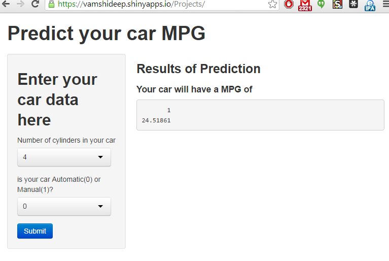

## Purpose

The purpose of this application is to predict your car's MPG.

To predict the MPG, we will need the following.

1. The number of cylinders in your car 

2. Transmission type of your car like Automatic or Manual

--- .class #id 

## Review of mtcars data set

```{r}
str(mtcars)
```

--- .class #id 

## Prediction Model

I have trained the model using Regression Modeling with number of cylinders and transmission type from mtcars data set

```{r}
fit <- lm(mpg ~ factor(cyl)+factor(am),data=mtcars)
```

--- .class #id 

## Application Link

Please check out the application your self over here

https://vamshideep.shinyapps.io/Projects



--- .class #id
